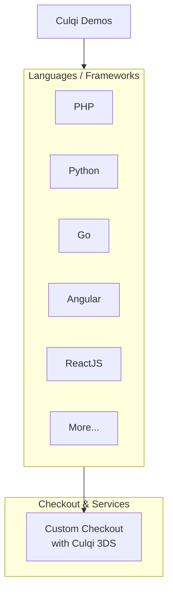

# Culqi-demos

Bienvenido al repositorio oficial de demos de Culqi. Aquí encontrarás ejemplos de integración con nuestras librerías de Checkout, 3DS y APIs en varios lenguajes de programación. Cada rama de este repositorio contiene un proyecto demo independiente que muestra cómo integrar y utilizar nuestras librerías y servicios. Si eres desarrollador y estás buscando una forma rápida de entender cómo trabajar con Culqi, este repositorio es un excelente punto de partida. ¡Esperamos que te sea útil!

## Estructura del Repositorio

Este repositorio está organizado en varias ramas, cada una correspondiente a un lenguaje de programación o framework específico. A continuación, se presenta la estructura del repositorio organizada por lenguajes y frameworks:

### Lenguajes de Programación

#### PHP
- [Php-checkout-charge](https://github.com/culqi/culqi-demos/tree/Php-checkout-charge)
<!-- - [Php-checkout-subscription](https://github.com/culqi/culqi-demos/tree/Php-checkout-subscription) -->
<!-- - [Php-jsv4-charge](https://github.com/culqi/culqi-demos/tree/Php-jsv4-charge) -->

#### Python
- [Python-checkout-charge](https://github.com/culqi/culqi-demos/tree/Python-checkout-charge)
<!-- - [Python-checkout-subscription](https://github.com/culqi/culqi-demos/tree/Python-checkout-subscription) -->

#### Go
- [Go-checkout-charge](https://github.com/culqi/culqi-demos/tree/Go-checkout-charge)

#### Java
- [Java-checkout-charge](https://github.com/culqi/culqi-demos/tree/Java-checkout-charge)

#### Android
- [Android-checkout-charge](https://github.com/culqi/culqi-demos/tree/Android-checkout-charge)

#### Ruby
- [Ruby-checkout-charge](https://github.com/culqi/culqi-demos/tree/Ruby-checkout-charge)

#### Rust
- [Rust-checkout-charge](https://github.com/culqi/culqi-demos/tree/Rust-checkout-charge)

### Frameworks

#### Angular
- [Angular-checkout-charge](https://github.com/culqi/culqi-demos/tree/Angular-checkout-charge)

#### ReactJS
- [Reactjs-checkout-charge](https://github.com/culqi/culqi-demos/tree/Reactjs-checkout-charge)

Cada rama contiene un proyecto demo independiente.

## Diagrama de Organización de las Ramas

El siguiente diagrama de flujo proporciona una visión general de cómo se estructuran nuestros proyectos demo en términos de servicios de API, Checkout y otros componentes. Cada nodo en el diagrama representa un componente específico de un proyecto demo.

En este diagrama, el nodo Culqi Demos representa el repositorio principal. De este nodo, se ramifica al nodo Lenguajes que representa los diferentes lenguajes de programación. Dentro de este nodo, se encuentran los nodos que representan los lenguajes de programación actuales (PHP, Python, Go, Angular, ReactJS) y un nodo `More...` que indica que se pueden agregar más lenguajes en el futuro.

Cada lenguaje de programación se conecta a los servicios de "Checkout" que corresponden a las funcionalidades implementadas en ese lenguaje.