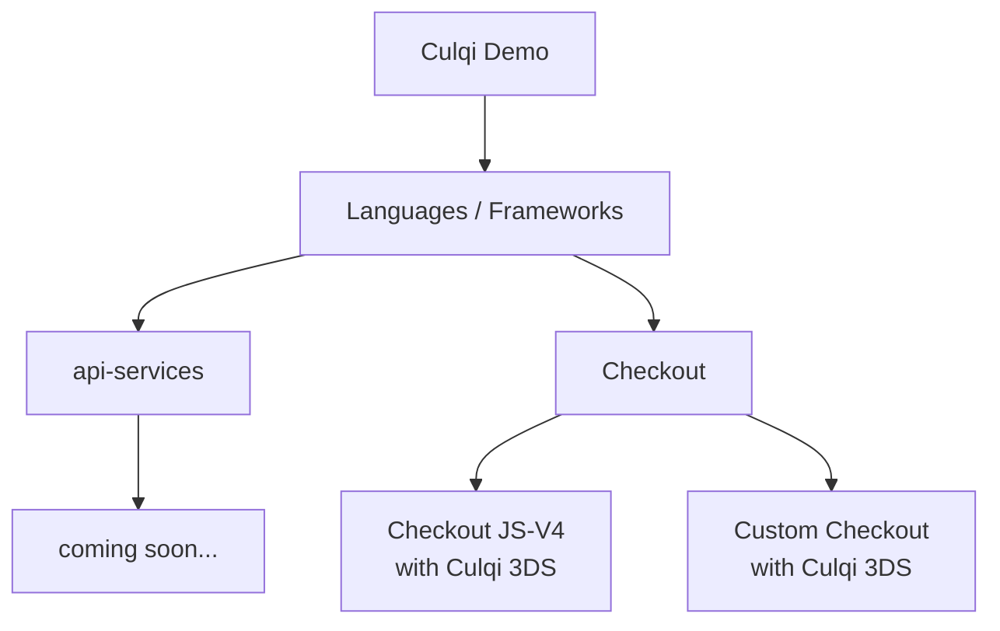

# Culqi-demos

Este es el repositorio oficial de demos de Culqi. Aquí encontrarás ejemplos de integración con nuestras librerías de Checkout, 3DS y APIs en varios lenguajes de programación. Cada demo es un proyecto pequeño que muestra cómo integrar y utilizar nuestras librerías y servicios. Si eres desarrollador y estás buscando una forma rápida de entender cómo trabajar con Culqi, este repositorio es un excelente punto de partida. ¡Esperamos que te sea útil!

## Diagrama de Flujo de Integración

El siguiente diagrama de flujo proporciona una visión general de cómo se estructuran nuestros proyectos demo en términos de servicios de API, Checkout y otros componentes. Cada nodo en el diagrama representa un componente específico de un proyecto demo.

Aquí tienes algunos enlaces a los proyectos demo que corresponden a los componentes del diagrama:

### PHP
- [Demo Custom Checkout con Culqi 3DS](./php/checkout/custom-checkout-with-culqi3ds/README.md)
- [Demo Checkout JSV4 con Culqi 3DS](./php/checkout/jsv4-with-culqi3ds/README.md)

### JAVA
- [DEMO Custom Checkout con Culqi 3DS](./java/checkout/custom-checkout-with-culqi3ds/README.md)